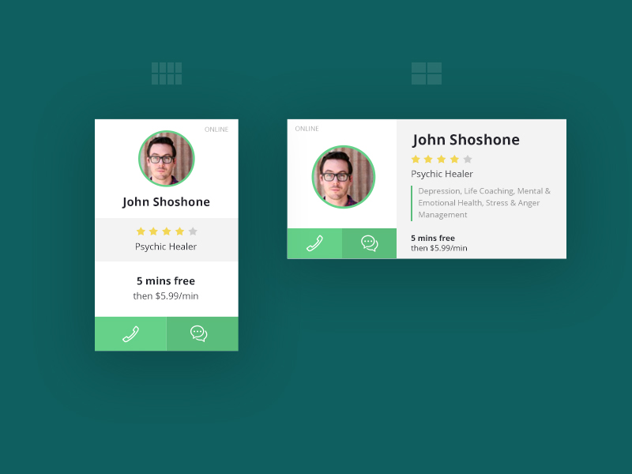

# Flexbox / CSS Grid - Lab

## Intro

Time for some practice laying out elements using Flexbox and CSS Grid!

This lab is a DELIVERABLE.

## Exercise

Choose either the vertical or horizontal “profile card” above to reproduce using HTML and CSS.

Use a combination of Flexbox and CSS Grid to layout the individual elements as close as possible - it does not have to be perfect!

## Setup

1. Create an HTML/CSS/JS repl
2. Name the repl “Flexbox/Grid Lab”

## Hints

- Be sure to start with a bit of CSS reset:

    * {
        box-sizing: border-box;
    }

    body {
        margin: 0;
        font-family: Helvetica;
    }

- Use the Digital Color Meter application that comes with the Mac to “pick” the colors from the screen.

- Elements can be made to appear circular by using border-radius: 50%;.

- For the rating scale with the stars, feel free to use this image tag:

  

- You can ignore the “phone” & “conversation” icons, just set the background colors of the “box”.

## Bonus

As a bonus, reproduce both the vertical and horizontal versions!

This lab is a DELIVERABLE - be sure to submit the link to your repl prior to the due date.